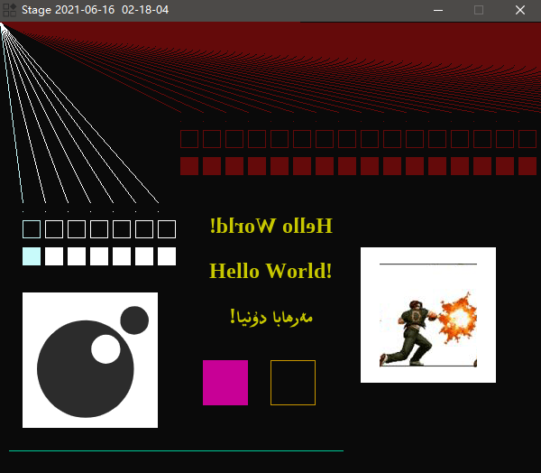

## DSL2-lua-binding

### 0.Aboud

> this is a [SDL2](https://www.libsdl.org/) lua binding, we can use SDL2 api via lua script ...

## 2.Build

* download libraries (read the `library/README.MD` file for more information)
* install [msys2](https://www.msys2.org/)
* install mingw (run `pacman -S mingw-w64-x86_64-toolchain base-devel` in msys2 terminal)
* install [chocolatey](https://chocolatey.org/)
* install make (run `choco install make`)
* then run `make` command in root directory

## 3.Document

> check `./scripts/stage.lua` and `./src/bridge.c` files to more information. 

## 3.Demo

